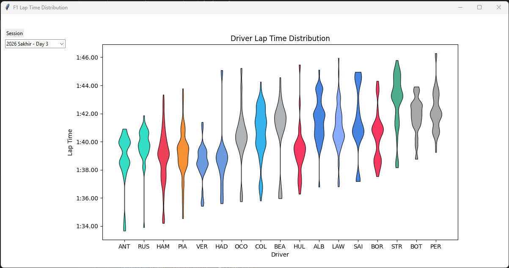

## F1 Data Analysis

The project lets you select a F1 session that has already been completed, it will then get all the lap time data from that session and map the laps of each driver onto a graph. This allows for the pace of drivers to be easily compared.

